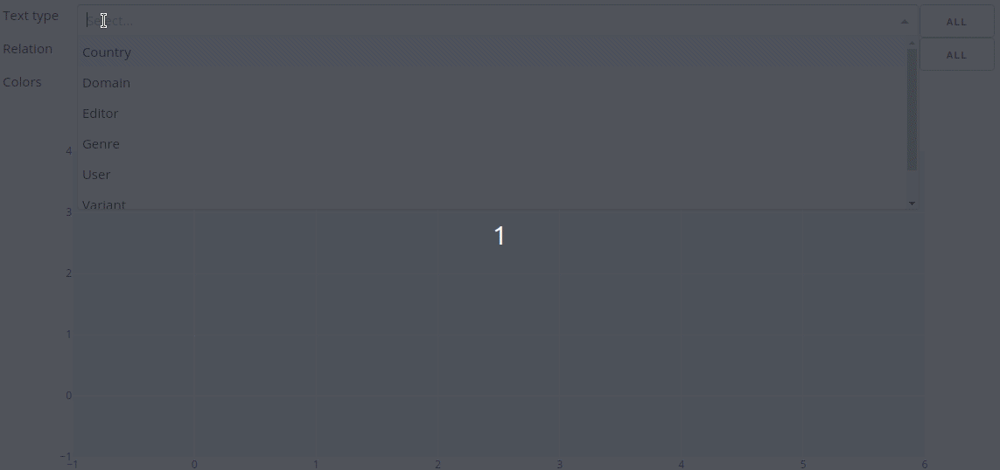

# Sketch Grammar Explorer

An app for evaluating *semantic sketch grammars* (a type of semantic relation-based knowledge mining syntax)

## About

Sketch Grammar Explorer (SGE) is a [Dash](https://dash.plotly.com/) web application to help visualize the data for a semantic sketch grammar. The SGE retrieves frequencies from the [Sketch Engine](https://www.sketchengine.eu/) corpus management system using Python scripts and API calls. The app then generates interactive graphs that show how sketch grammar concordances are distributed in a corpus.

The SGE is meant to help evaluate and improve the EcoLexicon Semantic Sketch Grammar (ESSG), from the University of Granada's [LexiCon research group](https://lexicon.ugr.es/). The app analyzes concordances from the EcoLexicon corpus, a collection of specialized environmental texts used as the source data for the [EcoLexicon terminological knowledge base](http://ecolexicon.ugr.es/).

What is a semantic sketch grammar? It's a kind of knowledge extraction tool meant to automate the process of finding useful information in texts. This kind of grammar looks for pairs of terms that have specific semantic relations (*type_of*, *part_of*, *result_of*, etc.) for the purpose of mapping how terms relate to each other within a discipline. Semantic sketch grammars are particularly for computational terminologists and translators who specialize in domain-specific content.

The SGE isn't for mining data itself, but is rather part of a corpus linguistics method to evaluate how a sketch grammar picks up terms from different areas of a corpus. Since a grammar like the ESSG may look for many different semantic relations in various text types, a tool like the SGE helps synthesize the data: it is meant to efficiently make sense of how a query syntax is functioning and how it can be improved.

## Usage

### Interactive graphs

* Use dropdowns to select the desired conceptual relation(s) and text type(s)
* Change colors from continuous to discrete depending on what data you want to compare
* Select and deselect legend items
  * Single click to toggle between all/one item
  * Double click to add/remove items from current selection
* Zoom to area
* Hover for details



### Interactive tables

* Show summary data by text type or relation
* Show/hide frequency data
* Sort/filter data
  * Numbers: 
    * e.g., "79" (quotes required)
    * Results will include 79 & 23.79
  * Greater, lesser & equals signs:
    * e.g., >=64, !=author & <102
    * Quotes usually optional
  * Text
    * e.g., atmospheric sciences
    * Quotes usually optional


## Recreating the Data Set

None of the data are provided in this repository, so follow these steps for initial setup (requires a Sketch Engine account).

### Python prep

Clone the repository, create a virtual environment and install the packages in requirements.txt.

### App setup

#### 1. API access

Define your Sketch Engine username and api key by creating a file in the repository named `auth_api.txt` with the following format:

``` bash
username:YOUR USERNAME
api_key:YOUR API KEY
```

#### 2. Password protection

The app can be deployed to a server or used locally. To use it locally without authentication, make sure these lines are commented out in the `app.py` file:

``` python
import dash_auth

with open('auth_app.txt') as f:
    VALID_USERNAME_PASSWORD_PAIRS = dict(x.rstrip().split(":") for x in f)

auth = dash_auth.BasicAuth(app, VALID_USERNAME_PASSWORD_PAIRS)
```

#### 3. Add sketch grammar

Supply a file named `grammar.txt` that contains the desired sketch grammar. The EcoLexicon Semantic Sketch Grammar is available [here](https://ecolexicon.ugr.es/ecolexicon_sketch_file.html).

If using a sketch grammar other than EcoLexicon's, adapting the Python scripts is necessary.

#### 4. Get corpus info

Run `corp_info.py` to retrieve the corpus details.

#### 5. Get data

Run `freqs_api.py` to collect frequency data for each CQL expression.

#### 6. Process data

Run `freqs_prep.py` to process the data, generate statistics, and save it in .csv files.

#### 7. Run the app

Run `app.py` and open a browser window to <http://127.0.0.1:8050/>.

## Using other corpora

The ESG is designed for using the EcoLexicon English Corpus, but it can be modified to work with corpora on Sketch Engine that have text type metadata and have been compiled with a sketch grammar. Refer to [Sketch Engine](https://www.sketchengine.eu/documentation/api-documentation/) and [Dash](https://dash.plotly.com/).
