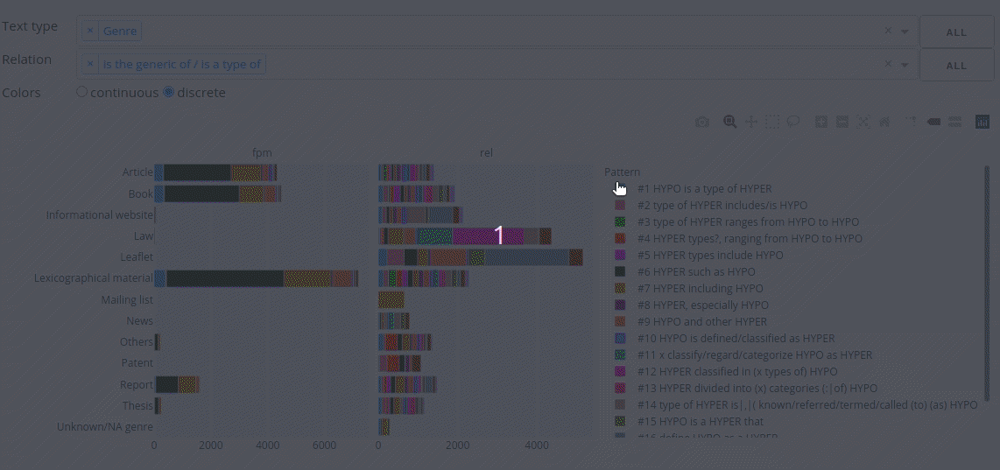

# Sketch Grammar Explorer

## About

Sketch Grammar Explorer (SGE) is a [Dash](https://dash.plotly.com/) web application to help visualize the data for a semantic sketch grammar. The SGE retrieves frequencies from the [Sketch Engine](https://www.sketchengine.eu/) corpus management system using Python scripts and API calls. The app then generates interactive graphs that show how sketch grammar concordances are distributed in a corpus.

The SGE is meant to help evaluate and improve the EcoLexicon Semantic Sketch Grammar (ESSG), from the University of Granada's [LexiCon research group](https://lexicon.ugr.es/). The app analyzes concordances from the EcoLexicon corpus, a collection of specialized environmental texts used as the source data for the [EcoLexicon terminological knowledge base](http://ecolexicon.ugr.es/).

What is a semantic sketch grammar? It is a kind of knowledge extraction tool meant to automate the process of finding useful information in texts. This kind of grammar looks for pairs of terms that have specific semantic relations so that linguists can map how terms relate to each other within a discipline.

The SGE focuses on exploring how concordances are distributed in a corpus by text types, such as genre, domain, and editor. It is also an attempt to


## Usage

### Graphs

* Use dropdowns to select the desired conceptual relation and text type
* Change colors from continuous to discrete depending on what data you want to compare

* Select and deselect legend items:
  * single click to toggle between all/one item
  * double click to add/remove items from current selection
  


### Tables

* numbers: 
  * e.g. "79" (quotes required)
  * results will include 79 & 23.79
* greater, lesser & equals signs:
  * e.g. >=64, !=author & <102
  * quotes usually optional
* text
  * e.g. atmospheric sciences
  * quotes usually optional

## Recreating the Data Set

None of the data are provided in this repository, so follow these steps for initial setup.

### Python prep

Create a virtual environment and install requirements.txt.

### App setup

#### API access

Define your Sketch Engine username and api key in a file named `auth_api.txt` with the following format:

``` bash
username:YOUR USERNAME
api_key:YOUR API KEY
```

#### Password protection

To use the app locally, comment out these lines in `app.py`:

``` python
import dash_auth

with open('auth_app.txt') as f:
    VALID_USERNAME_PASSWORD_PAIRS = dict(x.rstrip().split(":") for x in f)

auth = dash_auth.BasicAuth(app, VALID_USERNAME_PASSWORD_PAIRS)
```

#### Add sketch grammar

Supply a file named `grammar.txt` that contains the desired sketch grammar. The EcoLexicon Semantic Sketch Grammar is available [here](https://ecolexicon.ugr.es/ecolexicon_sketch_file.html).

If using a sketch grammar other than EcoLexicon's, adapting the Python scripts is necessary.

#### Get corpus info

Run `corp_info.py` to retrieve the corpus details.

#### Get data

Run `freqs_api.py` to collect frequency data for each CQL expression.

#### Process data

Run `freqs_prep.py` to process the data, generate statistics, and save it in .csv files.

## Using other corpora

Refer to [Sketch Engine](https://www.sketchengine.eu/documentation/api-documentation/) and [Dash](https://dash.plotly.com/) to customize the app.