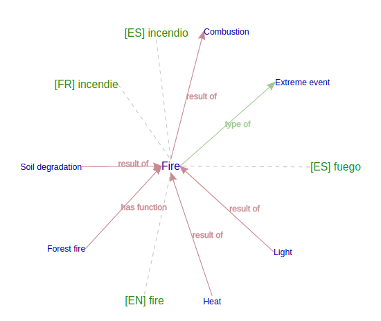
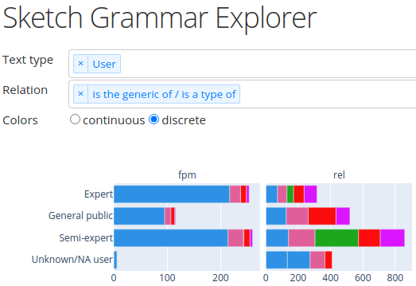
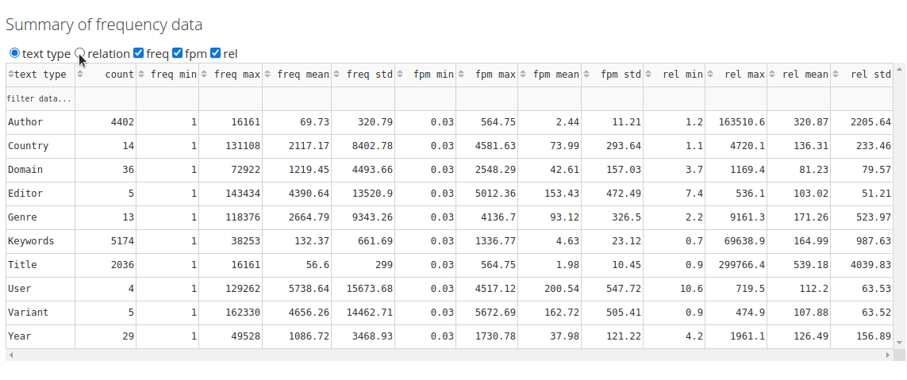

# Sketch Grammar Explorer

An app for evaluating *sketch grammars* using the Sketch Engine API. [(Source code)](https://github.com/engisalor/sketch-grammar-explorer)

- [Sketch Grammar Explorer](#sketch-grammar-explorer)
  - [About](#about)
  - [Purpose](#purpose)
  - [Usage](#usage)
    - [Layout](#layout)
    - [Interactive graphs](#interactive-graphs)
    - [Interactive tables](#interactive-tables)
  - [FAQ](#faq)

## About

Sketch Grammar Explorer (SGE) is a [Dash](https://dash.plotly.com/) web application for visualizing sketch grammar frequency data. The SGE retrieves frequencies from the [Sketch Engine](https://www.sketchengine.eu/) corpus management system using Python scripts. It generates interactive graphs that show how sketch grammar concordances are distributed in a corpus.

The SGE is meant to help evaluate and improve the EcoLexicon Semantic Sketch Grammar (ESSG), from the University of Granada's [LexiCon research group](https://lexicon.ugr.es/). The app analyzes concordances from the EcoLexicon English Corpus, a collection of specialized environmental texts used as the source data for the [EcoLexicon terminological knowledge base](http://ecolexicon.ugr.es/).

## Purpose

What is a semantic sketch grammar? It's a knowledge extraction tool meant to automate the process of finding useful information in digital texts.

This kind of grammar looks for pairs of terms that have specific semantic relations (*type of*, *part of*, *result of*, etc.) for the purpose of mapping how terms relate to each other within a discipline. Semantic sketch grammars may be particularly useful for terminologists and translators who specialize in domain-specific content. The end goal of such tools is to develop a conceptual system of a subject area. The example below, from [EcoLexicon](http://ecolexicon.ugr.es/), shows a conceptual map of the term "fire."

The SGE isn't for mining data itself, but is rather part of a corpus linguistics method to evaluate how a sketch grammar picks up terms from different areas of a corpus. Since the ESSG looks for many different semantic relations in various text types, the SGE is meant to help synthesize the quantitative data and visualize it.

## Usage

### Layout

SGE graphs contain the following elements:

- Two frequency types: frequency per million (fpm) and relative frequency (rel)
- Text type categories (e.g., User) and their entries (Expert, Semi-expert)
- Relational categories (is the generic of / is a type of) and a list of conceptual relations (shown in the legend) that use different key phrases, like *type of* or *such as*

### Interactive graphs

- Use dropdowns to select the desired conceptual relation(s) and text type(s)
- Change colors from continuous to discrete
- Select and deselect legend items
  - Single click to toggle between all/one item
  - Double click to add/remove items from  the current selection
- Zoom to an area
- Hover for details

### Interactive tables

- Show summary data by text type or relation
- Show/hide frequency data
- Sort/filter data
  - Number formatting:
    - "79" (quotes required)
    - Results will include 79 and 23.79
  - Greater, lesser and equals signs:
    - \>=64, !=author, or  <102
    - Quotes are usually optional
  - Text
    - atmospheric sciences
    - Quotes are usually optional

## FAQ

- A deployed version is on [Heroku](https://sketch-grammar-explorer.herokuapp.com/)
- Other usage requires Sketch Engine credentials
- See [Sketch Engine](https://www.sketchengine.eu/documentation/api-documentation/) API documentation
- See [Dash](https://dash.plotly.com/) documentation for app development
- Python scripts must be modified for use with other corpora
